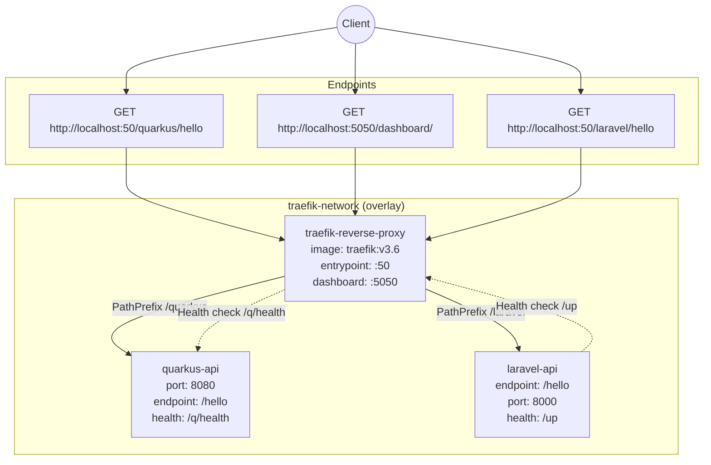

# Simple Reverse Proxy
This project shows how to create a simple reverse proxy that routes two services that expose two endpoints using different url prefixes in a Docker Swarm enviroment.

## Reverse Proxy Topology



## Services

- `traefik-reverse-proxy`
  - Entry point: `web` on container port `80` (host `50`)
  - Dashboard/API: host port `5050`
  - Routes requests to backend services using labels.

- `quarkus-api`
  - Routed by Traefik with path prefix: `/quarkus`
  - Internal service port: `8080`
  - Health check: `/q/health`

- `laravel-api`
  - Routed by Traefik with path prefix: `/laravel`
  - Internal service port: `8000`
  - Health check: `/up`

## How to Run Project

### Quarkus API

First of all, make sure you are in the `quarkus-hello-world` folder.

1. Compile Quarkus Project (native way)

   ```bash
   ./mvnw package -Dnative -Dquarkus.native.container-build=true
   ```

2. Create Docker Image

   ```bash
   docker build -f src/main/docker/Dockerfile.native -t quarkus-api-image .
   ```

### Laravel API

First of all, make sure you are in the `laravel-hello-world` folder.

1. Create Docker Image

   ```bash
   docker build -t laravel-api-image .
   ```

### Docker Compose
After you create laravel-api-image and quarkus-api-image you can run the docker-compose.yaml

1. Deploy stack

   ```bash
   docker stack deploy -c docker-compose.yaml simple-reverse-proxy-stack -d
   ```